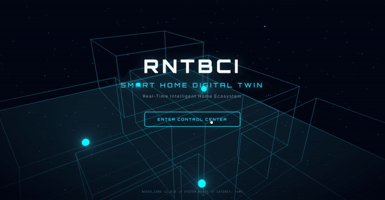
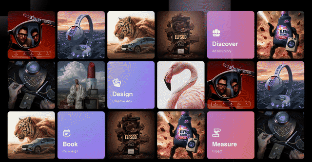
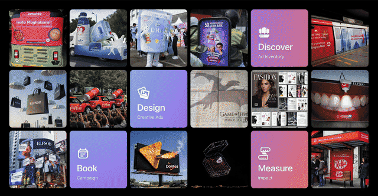
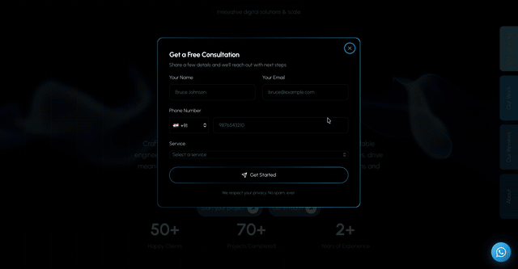
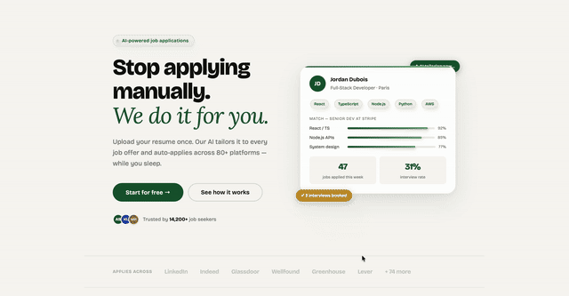
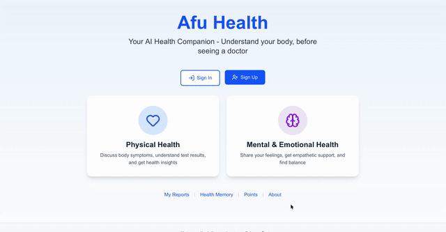

<!-- ========================================================= -->
<!--                    ARNAV PUGGAL / README                   -->
<!-- ========================================================= -->

<p align="center">
  
</p>

<p align="center">
  
</p>

<p align="center">
  <a href="https://github.com/12asascoder">
    
  </a>
  <a href="https://www.linkedin.com/in/arnav-puggal/">
    
  </a>
  <a href="https://www.spazorlabs.com">
    
  </a>
  <a href="mailto:arnavpuggal21@gmail.com">
    
  </a>
</p>

---

# 🧠 `WHO_AM_I()`

```text
┌─────────────────────────────────────────────────────────────────┐
│                                                                 │
│   NAME       →  ARNAV PUGGAL                                   │
│   ROLE       →  SOFTWARE ENGINEERING × FULL-STACK              │
│   MODE       →  BUILD / BREAK / LEARN / SHIP                   │
│   INTERESTS  →  AI · SYSTEMS · SECURITY · CLOUD · PRODUCTS     │
│   CURRENT    →  TURNING IDEAS INTO DEPLOYED SOFTWARE            │
│                                                                 │
│   STATUS     →  ███████████████████████░░  BUILDING            │
│                                                                 │
└─────────────────────────────────────────────────────────────────┘
```

I don't really build **"side projects."**

I build things that usually begin with:

> **"wait... what if we actually built this?"**

Then the pipeline kicks in:

`IDEA → PROTOTYPE → ARCHITECTURE → CODE → CHAOS → DEBUG → DEPLOY → ITERATE`

I'm a Software Engineering student and full-stack developer who enjoys
the intersection of **software, AI, automation, cybersecurity and product engineering**.

I like problems without a copy-paste solution.

---

# ⚡ `CURRENTLY_IN_THE_LAB`

<p align="center">
  
</p>

| 🔭 Building | 🧠 Learning | 🤝 Open To |
|---|---|---|
| Full-stack products, AI-powered systems & automation | System Design, AI/ML, Cybersecurity, Cloud & Distributed Systems | Open source, startups, hackathons, research & ambitious builds |

---

---

# 🚀 `TOP_PROJECTS`

<p align="center">
  
</p>

| 🚀 Project | 🎬 Live Demo | 🧩 Stack |
|:---|:---:|:---|
| **RNTBCI Project** | [](https://rntbci-project.vercel.app) | `LIVE` |
| **ELFSOD 1.0** | [](https://elfsod1-0.vercel.app) | `LIVE` |
| **ELFSOD 2.0** | [](https://elfsod-dev.vercel.app) | `DEV` |
| **SpazorLabs** | [](https://www.spazorlabs.com) | `LIVE` |
| **RESUMIND** | [](https://resumind-frontend.vercel.app) | `LIVE` |
| **Health Companion** | [](https://health-companion-eight.vercel.app) | `LIVE` |

<p align="center">
  <sub>
    ⚡ Animated previews are generated from the actual deployed builds.
    <br/>
    Click any preview to enter the live system.
  </sub>
</p>

---
# 🧬 `TECH_LOADOUT`

### ⚔️ Languages
<p>
  
</p>

### 🎨 Frontend
<p>
  
</p>

### ⚙️ Backend & APIs
<p>
  
</p>

### 🗄️ Data
<p>
  
</p>

### ☁️ Cloud / DevOps
<p>
  
</p>

### 🤖 AI / ML / Creative
<p>
  
</p>
---
# 📊 `DEVELOPER_TELEMETRY`

<p align="center">

  

  

</p>

<p align="center">

  

</p>
---

# 📡 `ACTIVITY_SIGNAL`

<p align="center">
  
</p>

---

# 🌐 `ESTABLISH_CONNECTION`

<p align="center">
  <a href="https://www.linkedin.com/in/arnav-puggal/">
    
  </a>
  <a href="https://www.instagram.com/arnav_puggal/">
    
  </a>
  <a href="mailto:arnavpuggal21@gmail.com">
    
  </a>
  <a href="https://www.spazorlabs.com">
    
  </a>
</p>

<p align="center">
  
</p>

---

<p align="center">
  
</p>

<p align="center">
  <b>BUILD → BREAK → LEARN → SHIP → REPEAT</b>
  <br/>
  <sub>Still experimenting. Still learning. Still shipping.</sub>
</p>
